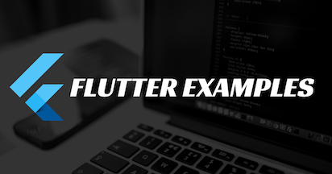
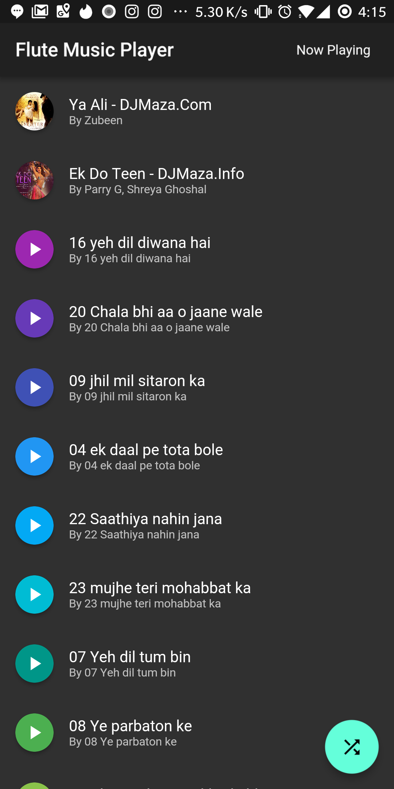
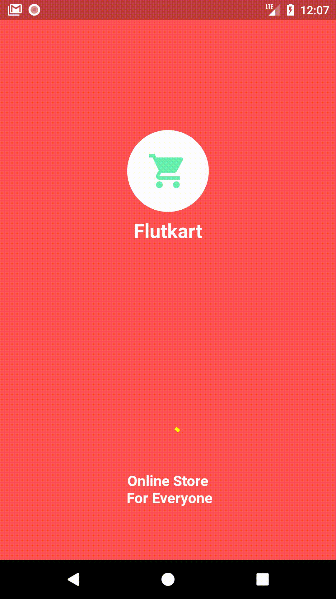
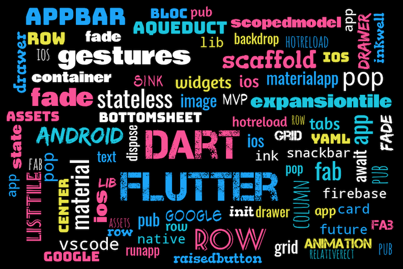

### Show some :heart: and star the repo to support the project

     

This repository containing links of all the example apps demonstrating features/functionality/integrations in [Flutter](https://flutter.io/) application development.

## YouTube Channel

[MTechViral](https://www.youtube.com/c/MTechViral)

## Facebook Group

[Let's Flutter With Dart](https://www.facebook.com/groups/425920117856409/)

### Some Screenshots

  
  
  
  
 

 

## Flutter Example Apps (Source Code + YouTube Link)

## Clones/Apps

1.  [Flutter WhatsApp Clone App](https://github.com/iampawan/FlutterWhatsAppClone)

1.  [Flutter Instagram Clone App](https://github.com/iampawan/Flutter-Instagram-UI-Clone)

1.  [Flutter Build a Beautiful Pokemon App - English](https://github.com/iampawan/PokemonApp)

1.  [Flutter Build a Beautiful Pokemon App - Hindi](https://github.com/iampawan/PokemonApp)

1.  [Flutter Responsive Game of Thrones Flutter App](https://github.com/iampawan/GOT2019)

1.  [Flutter: Quiz App](https://github.com/iampawan/FlutterQuizApp)

1.  [Flutter StackOverflow App](https://github.com/iampawan/FlutterStackOverflowApp)

1.  [Flutter Gender Prediction App](https://github.com/iampawan/FlutterGenderPredictor)

1.  [Flutter Cocktail App](https://github.com/iampawan/Cocktail-App)

1.  [Flutter Gif Search Engine App](https://youtu.be/akMH3UOvYu8)

1.  [Flutter QuotesX App](https://youtu.be/_65Ixfu9nSo)

## Flutter For Web / Desktop / Responsive

1.  [Flutter For Web: Getting Started | Migrating PokemonApp to Web](https://github.com/iampawan/FlutterForWebDemoApp)

1.  [Flutter Web: Making a Responsive Portfolio App | Part 1](https://github.com/iampawan/MyPortfolio)

1.  [Flutter Web: Deploying Portfolio App To Github.IO | Peanut Tutorial | Part 2](http://mtechviral.com/myportfolio/#/)

1.  [Flutter Web: Deploying Flutter UIKit to Github Pages | Peanut Tutorial](http://mtechviral.com/Flutter-UI-Kit/)

1.  [Flutter Web : Flutter 1.10 Adding Web Support For New & Existing Projects](http://mtechviral.com/Flutter-UI-Kit/)

1.  [Flutter Web Desktop Cocktail App](https://github.com/iampawan/Cocktail-App/tree/dev)

1.  [Flutter PWA Tutorial - 1/2](https://github.com/iampawan/GOT_FLUTTER_PWA)

1.  [Flutter Official PWA Support - 2/2](https://github.com/iampawan/GOT_FLUTTER_PWA)

1.  [Flutter Responsive Portfolio App | Flutter Mobile, Web, & Desktop | SpeedX Code](https://github.com/iampawan/PortfolioX)

## Flutter Designs

1.  [Adobe XD Flutter Early Access Tutorial | Getting Started](https://youtu.be/ZcS66NNbTGw)

1.  [Beautiful Nike Web Design Concept With Flutter](https://github.com/iampawan/FUI01-NikeWebFlutter)

## Beginners & Intermediate

1.  [Flutter Devfest App](https://github.com/iampawan/GDG-DevFest-App)

1.  [Flutter Firebase MLKIT App](https://github.com/iampawan/FlutterWithFirebase/tree/mlkit)

1.  [Flutter Tic Tac Toe Game](https://github.com/iampawan/FlutterTicTacToe)

1.  [Flutter Music Player App](https://github.com/iampawan/Flutter-Music-Player)

1.  [Flute Music Plugin](https://github.com/iampawan/Flute-Music-Player)

1.  [Flutter Firebase Setup](https://github.com/iampawan/FlutterWithFirebase)

1.  [Flutter Firebase CRUD](https://github.com/iampawan/FlutterWithFirebase)

1.  [Flutter Bottom Sheet App](https://github.com/iampawan/FlutterBottomSheet)

1.  [Flutter WebSockets App](https://github.com/iampawan/flutter_websocket)

1.  [Flutter Sqflite MVP App](https://github.com/iampawan/Flutter-Sqflite-MVP)

1.  [Flutter Crypto App](https://github.com/iampawan/CryptoApp)

1.  [Flutter Redux App](https://github.com/iampawan/Redux-Tutorial-Flutter)

1.  [Flutter Frenzy Chat App](https://github.com/iampawan/frenzychatapp)

1.  [Flutter Calculator](https://github.com/iampawan/fluttercalculator)

1.  [Flutter Login Page App](https://github.com/iampawan/flutterlogin)

1.  [Flutter Login Page Bloc Pattern App](https://github.com/iampawan/FlutterLoginPageBloc)

1.  [Flutter Beautiful Material Navigation Drawer](https://www.youtube.com/watch?v=iYH2jzUM1Nc)

1.  [Flutter Material Design Widgets - | Tabs | BottomNavigationBar | Stepper | Snackbar etc App](https://www.youtube.com/watch?v=5_zQ6rjv00s)

1.  [Flutter Git Quick Start Guide](https://www.youtube.com/watch?v=kVow5q53WG8)

1.  [Flutter Local JSON App](https://www.youtube.com/watch?v=bTwTKwK3hGc)

1.  [Flutter Fetching App Using HTTP](https://www.youtube.com/watch?v=aIJU68Phi1w)

1.  [Flutter Swipe to delete ListView App](https://www.youtube.com/watch?v=AzOONgeCVKg)

1.  [Flutter Line Clipping App](https://www.youtube.com/watch?v=fqqY3NBVVHA)

1.  [Flutter Bezier Curve App](https://www.youtube.com/watch?v=LnUhNTUl3Mc)

1.  [Flutter CryptoShadow](https://github.com/huextrat/CryptoShadow) [Hugo EXTRAT](https://github.com/huextrat/)

1.  [Flutter LifeCycle And Orientation](https://github.com/iampawan/FlutterLifeCycleAndOrientation)

1.  [Flutter Splash Screen - FlutKart](https://github.com/iampawan/FlutKart)

1.  [Flutter Real Splash Screens for both OS]()

1.  [Flutter Walkthrough Package & App](https://github.com/iampawan/Flutter-Walkthrough)

1.  [Flutter Validating Form - Login Form](https://github.com/iampawan/FlutterForms)

1.  [Flutter Age Calculator App](https://github.com/iampawan/FlutterAnimatedAgeCalculatorApp)

1.  [Flutter Collapsing Toolbar Layout](https://github.com/iampawan/FlutterCollapsingToolbar)

1.  [Flutter PullToRefresh ListView](https://github.com/iampawan/flutter_pull_to_refresh)

1.  [Flutter Internet Connectivity](https://github.com/iampawan/flutter_connectivity)

1.  [Flutter Access Camera App](https://github.com/iampawan/FlutterWhatsAppClone)

1.  [Firebase Build Beautiful Wallpaper App P1](https://github.com/iampawan/FlutterWithFirebase)

1.  [Flutter: Integrate Ads | Create Admob Account P2](https://github.com/iampawan/FlutterWithFirebase)

1.  [Flutter: Integrate Analytics | Firebase Analytics | Handling Library Issues P3](https://github.com/iampawan/FlutterWithFirebase)

1.  [Flutter: Prepare App For Release | App Signing | Create JKS P4](https://github.com/iampawan/FlutterWithFirebase)

1.  [Flutter: Publish App to PlayStore | Fully Explained Demo P5](https://github.com/iampawan/FlutterWithFirebase)

1.  [Flutter: Expandable & Sticky Header List](https://github.com/iampawan/FlutterExpandableAndStickyHeaderList)

1.  [Flutter: Backdrop Widget Tutorial | Material Design 2.0](https://github.com/iampawan/FlutterBackdrop)

1.  [Flutter: QR Code Scanner App](https://github.com/iampawan/FlutterQRScanner-App)

1.  [Flutter: Integrate Google Maps Tutorial](https://github.com/iampawan/FlutterGoogleMaps)

1.  [VSCode Tips & Tricks | Flutter | 20 Useful Shortcuts](https://youtu.be/sCb44rmNMfM)

1.  [Flutter: Handle Back Button Pressed | WillPopScope Widget](https://youtu.be/fYBCzgBRkb4)

1.  [Flutter: Programatically Check Whether Debug OR Release Mode](https://www.youtube.com/watch?v=xyVXbNMJoIk)

1.  [Flutter: Make New Gmail Like FloatingActionButton](https://github.com/iampawan/Flutter-UI-Kit)

1.  [Routes in Flutter | Push | PushNamed | GenerateRoute | Unknown Route](https://github.com/iampawan/Flutter-Routes)

1.  [Flutter: Data Connection Checker | Wifi connected but no internet](https://pub.dev/packages/data_connection_checker)

1.  [Flutter: Android App Bundle Step By Step Guide](https://youtu.be/dRbmjsqERVw)

1.  [Flutter: Click | Pick | Crop | Compress an Image | AndroidX](https://github.com/iampawan/Flutter_Click_Pick_Crop_Compress)

1.  [Flutter: Overriding Dependencies | Solving Version Conflicts](https://github.com/iampawan/FlutterUtilsCollection)

1.  [Flutter: Styling Google Maps For Multiple Themes | Android & iOS | Official Plugin](https://github.com/iampawan/GDG-DevFest-App)

1.  [Flutter: WhatsApp Clone Status View | Story View Feature Tutorial](https://github.com/iampawan/FlutterWhatsAppClone)

1.  [Making Ubuntu like terminal in Flutter](https://github.com/iampawan/FlutterWhatsAppClone)

1.  [Westlife Using Flutter](https://github.com/renjingkai/WestlifeUsingFlutter)

## Advanced

1.  [Flutter Advanced: Signature App (CustomPainter)](https://github.com/iampawan/fluttersignatureview)

1.  [Flutter Advanced: Dynamic Theming | Change Theme At Runtime](https://github.com/iampawan/Flutter-Dynamic-Theming)

1.  [Flutter Advanced: Inherited Widget & Scoped Model Explained | Part - 1](https://github.com/iampawan/StateExperiments)

1.  [Flutter Advanced: BloC Pattern Explained | Part - 2](https://github.com/iampawan/StateExperiments)

1.  [Flutter Advanced Redux: Shopping Cart App From Scratch | Redux Time Travel](https://github.com/iampawan/FlutterShoppingCart)

1.  [Flutter Advanced: Build Your First Plugin For Android & iOS | Flutter Toasts](https://github.com/iampawan/FlutterToastPlugin)

1.  [Flutter Advanced: Download Large Files (Pdf, Json, Image etc) With Progress %](https://github.com/iampawan/FlutterDownloadFilesWithProgress)

1.  [Flutter Advanced: Async Programming | Future | Async Await](https://youtu.be/JJ4MvlXooCU)

1.  [Flutter Advanced: Semantic Versioning](https://youtu.be/iua7TjbeRHA)

1.  [Flutter Advanced : Build Beautiful Material Search App or Integrate it with Any App](https://youtu.be/FPcl1tu0gDs)

1.  [Flutter Advanced : Add Flutter To Existing Or New Android App](https://github.com/iampawan/AddFlutter2ExistingAndroidApp)

1.  [Flutter Advanced: The BloC Pattern on Whiteboard](https://youtu.be/LSljItPM_UE)

1.  [Flutter Advanced Login Page Bloc Pattern App](https://github.com/iampawan/FlutterLoginPageBloc)

1.  [Flutter Advanced Face ID & Touch ID/Fingerprint Local Auth App](https://github.com/iampawan/FlutterAuthFaceID-FingerPrint)

1.  [Flutter Advanced Securing your Flutter Apps | Prevent Screenshot App](https://github.com/iampawan/Flutter-UI-Kit)

1.  [Flutter Advanced: ARCore Tutorial | Sceneform | Exploring New Possibilities](https://github.com/iampawan/FlutterAR)

1.  [Flutter Advanced: ARKit Tutorial | iOS](https://github.com/iampawan/FlutterAR)

1.  [Flutter Advanced: PDF Viewer Tutorial Android & IOS | From URL & Asset](https://github.com/iampawan/FlutterPDFViewer)

1.  [Flutter Advanced: Auto Create Models from JSON | Serializable](https://github.com/iampawan/FlutterAutoJSONModel)

1.  [Flutter Advanced: Background Fetch | Run code in the background Android & iOS](https://github.com/iampawan/FlutterBackgroundFetch)

1.  [Flutter Advanced: Lazy Loading ListViews | Load More Data On Scroll](https://github.com/iampawan/FlutterUtilsCollection)

1.  [Flutter Advanced: Find Widget's Size & Position Using Render Object](https://github.com/iampawan/FlutterUtilsCollection)

1.  [Flutter Advanced: TensorFlow Lite | Object Detection | YoloV2 | SSD Tutorial](https://github.com/iampawan/TFLite-Flutter)

1.  [Flutter Zoom In Zoom Out And Rotate](https://github.com/iampawan/FlutterUtilsCollection)

## Flutter Animation Series

1.  [Flutter: Animation Series || Episode 1 || Basic Animation ](https://github.com/iampawan/AnimationSeries)

1.  [Flutter Animation: Ep 2 || Animation Series || Easing ](https://github.com/iampawan/AnimationSeries)

1.  [Flutter Animation: Ep 3 || Animation Series || Brick Animations](https://github.com/iampawan/AnimationSeries)

1.  [Flutter: Animation Series Ep 4 | Flipper Widget](https://github.com/iampawan/FlipperWidge)

1.  [Flutter Flare 1.0 : Getting Started With 2D Animations](https://github.com/iampawan/FlutterFlare-Basic)

1.  [Flutter - Making a Christmas Tree 🎄| Tween Animation](https://github.com/iampawan/FlutterChristmasTree)

## Flutter Library Series

1.  [Awesome HTTP Inspector Tool | Flutter Library of the Week | EP-01 ](https://github.com/iampawan/Flutter-Best-Packages)

1.  [Awesome Animated Loaders | Flutter Library of the Week | EP-02 ](https://github.com/iampawan/Flutter-Best-Packages)

1.  [Awesome Onboarding Experience | Flutter Library of the Week | EP-03](https://github.com/iampawan/Flutter-Best-Packages)

1.  [Awesome Overlays | Flutter Library of the Week | EP-04](https://github.com/iampawan/Flutter-Best-Packages)

1.  [Awesome Extensions | Flutter Library of the Week | EP-05](https://github.com/iampawan/Flutter-Best-Packages)

1.  [Storing Keys in .env file | BuildConfig | Flutter Library of the Week | EP-06](https://github.com/iampawan/Flutter-Best-Packages)

1.  [Flutter Powerful VelocityX | VelocityX | Ch01-Ch05](https://github.com/iampawan/VelocityX)

1.  [Flutter RxDart Explained - The Flutter Way](https://github.com/iampawan/Learning-RxDart)

## Flutter Weekly Widgets Series

1.  [Flutter: SizedBox | Flutter Weekly Widgets | Ep 1 ](https://github.com/iampawan/FlutterWidgets)

1.  [Flutter: Animated Builder | Improve Performance | Ep 2 ](https://github.com/iampawan/FlutterWidgets)

1.  [Flutter: Draggable & Drag Target | Ep 3 ](https://github.com/iampawan/FlutterWidgets)

1.  [Flutter: World of Cupertino (iOS) | Ep 4 ](https://github.com/iampawan/FlutterWidgets)

1.  [Flutter: Data Table | Ep 5 | Flutter Weekly Widgets ](https://github.com/iampawan/FlutterWidgets)

1.  [Flutter: WebView | Browser App | Ep 6 | Website to App](https://github.com/iampawan/FlutterWidgets)

1.  [Flutter Advanced: Overlay Widget | Ep 7 | Flutter Weekly Widgets ](https://github.com/iampawan/FlutterWidgets)

1.  [Flutter Advanced: Placeholder, Spacer, Visibility Widgets | Ep 8 ](https://github.com/iampawan/FlutterWidgets)

1.  [Flutter Weekly Widgets S02E01 | Reordable ListView](https://github.com/iampawan/FlutterWidgets)

1.  [Flutter Weekly Widgets S02E02 | 3D ListView](https://github.com/iampawan/FlutterWidgets)

1.  [Flutter Weekly Widgets S02E03 | Universal Error Widget](https://github.com/iampawan/FlutterWidgets)

## Plugins on pub.dartlang.org

1.  [Flutter VelocityX](https://pub.dev/packages/velocity_x)

1.  [Flutter Flute Music Plugin - First Open Source Flutter based material design music player with audio plugin to play local music files.(Online Radio will be added soon).](https://pub.dartlang.org/packages/flute_music_player)

1.  [Flutter Walkthrough - A new Flutter package for both android and iOS which helps developers in creating animated walkthrough of their app.](https://pub.dartlang.org/packages/flutter_walkthrough)

1.  [Flutter Toast PK - A new Flutter plugin for showing toast in android and ios.](https://pub.dartlang.org/packages/flutter_toast_pk)

1.  [Random PK - A new Flutter package that gives a container with random color.](https://pub.dartlang.org/packages/random_pk)

1.  [PK Skeleton - A Facebook & Twitter Like Card Loading Shimmer Skeleton Library..](https://pub.dartlang.org/packages/pk_skeleton)

1.  [MediumClapFlutter - A Custom Floating Action Button (FAB) library like clapping effect on Medium.](https://pub.dartlang.org/packages/medium_clap_flutter)

1.  [audioplayers - A Flutter plugin to play multiple simultaneously audio files, works for Android and iOS.](https://pub.dartlang.org/packages/audioplayers)

1.  [flame - A minimalist Flutter game engine.](https://pub.dartlang.org/packages/flame)

## Dart Series

1.  [Learn Dart Basics in 30 Mins](https://youtu.be/0CTj3x6jgeY)

1.  [Thread of Execution, Functions & Call Stack- Dart Under The Hood CH1](https://medium.com/@imthepk/thread-of-execution-functions-call-stack-dart-under-the-hood-ch1-c2e756504c)

## Dart Backend Series (Source Code + YouTube Link)

1.  [Dart: How to Setup Aqueduct | Intro | Aqueduct](https://github.com/iampawan/DartFirstApi)
1.  [Dart: How to write your first REST API | Intro & 1/7 | Aqueduct](https://github.com/iampawan/DartQuizApi)
1.  [Dart: How to make controllers ? | 1/7 | Aqueduct](https://github.com/iampawan/DartQuizApi)
1.  [Dart: Indexing And Routing ? | 2/7 | Aqueduct](https://github.com/iampawan/DartQuizApi)
1.  [Dart: How to write tests ? | 3/7 | Aqueduct](https://github.com/iampawan/DartQuizApi)
1.  [Dart: How to setup PostgreSQL ? | 4/7 | Aqueduct](https://github.com/iampawan/DartQuizApi)
1.  [Dart: How to write tests with test db ? | 5/7 | Aqueduct](https://github.com/iampawan/DartQuizApi)
1.  [Dart: What is ORM ? | 5/7 | Aqueduct](https://github.com/iampawan/DartQuizApi)
1.  [Dart: How to make DataModels ? | 5/7 | Aqueduct](https://github.com/iampawan/DartQuizApi)
1.  [Dart: What are Relationships and Joins | 6/7 | Aqueduct](https://github.com/iampawan/DartQuizApi)
1.  [Dart: How to deploy to real database ? | 7/7 | Aqueduct](https://github.com/iampawan/DartQuizApi)

1.  [Server Side Dart - Exploring Angel | First API](https://youtu.be/UzuecP3utk8)

1.  [Flutter App + Backend (Angel) = FullStack](https://github.com/iampawan/FlutterAngel)

1.  [Deno (Backend) + Flutter (Frontend) Full Tutorial | QuotesX API & APP](https://youtu.be/_65Ixfu9nSo)

## Workshops & Interviews

1.  [Flutter From Scratch - Workshop | Photos Info App | Instagram Clone & More](https://github.com/iampawan/FlutterChennai)

1.  [Taking Flight with VelocityX - Pawan Kumar (Flutter Week)](https://youtu.be/v1GmQZTBRaM)

1.  [Interview With A Googler | Chris Sells | Episode 01 | Flutter Q&A](https://pawan.live)

# Pull Requests

I welcome and encourage all pull requests. It usually will take me within 24-48 hours to respond to any issue or request. Here are some basic rules to follow to ensure timely addition of your request:

1.  Match the document style as closely as possible.
2.  Please keep PR titles easy to read and descriptive of changes, this will make them easier to merge :)
3.  Pull requests _must_ be made against `master` branch for this particular repository.
4.  Check for existing [issues](https://github.com/iampawan/FlutterExampleApps/issues) first, before filing an issue.
5.  Make sure you follow the set standard as all other projects in this repo do
6.  Have fun!

### Created & Maintained By

[Pawan Kumar](https://github.com/iampawan) ([@imthepk](https://www.twitter.com/imthepk)) ([YouTube](https://www.youtube.com/c/MTechViral))
([Instagram](https://www.instagram.com/codepur_ka_superhero))

> If you found this project helpful or you learned something from the source code and want to thank me, consider buying me a cup of :coffee:
>
> - [PayPal](https://www.paypal.me/imthepk/)

# License

    Copyright 2018 Pawan Kumar

    Licensed under the Apache License, Version 2.0 (the "License");
    you may not use this file except in compliance with the License.
    You may obtain a copy of the License at

       http://www.apache.org/licenses/LICENSE-2.0

    Unless required by applicable law or agreed to in writing, software
    distributed under the License is distributed on an "AS IS" BASIS,
    WITHOUT WARRANTIES OR CONDITIONS OF ANY KIND, either express or implied.
    See the License for the specific language governing permissions and
    limitations under the License.

## Getting Started

For help getting started with Flutter, view our online
[documentation](http://flutter.io/).

For help on editing plugin code, view the [documentation](https://flutter.io/platform-plugins/#edit-code).
