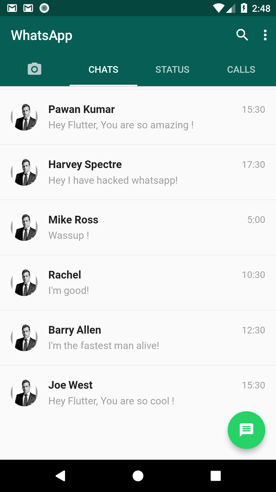
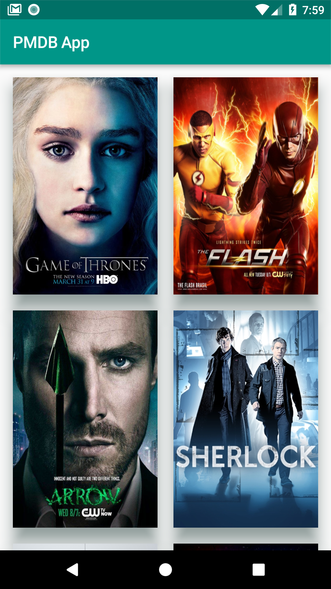
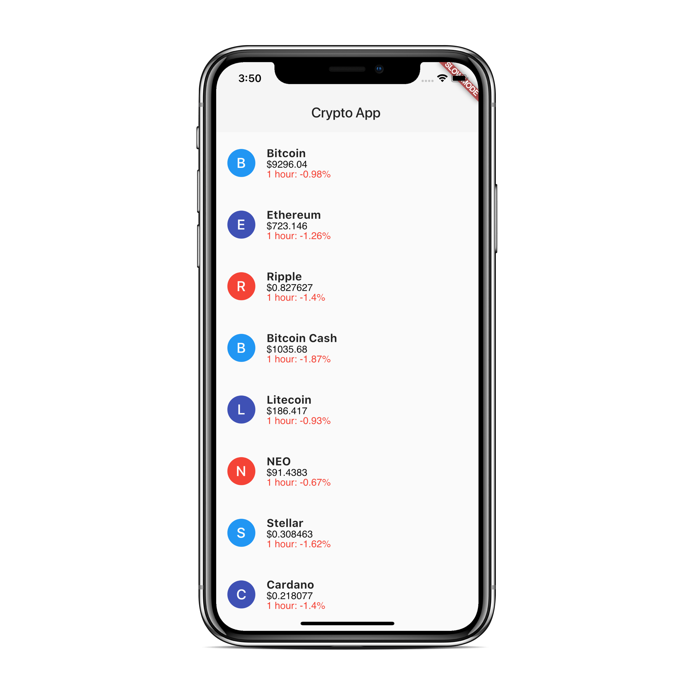
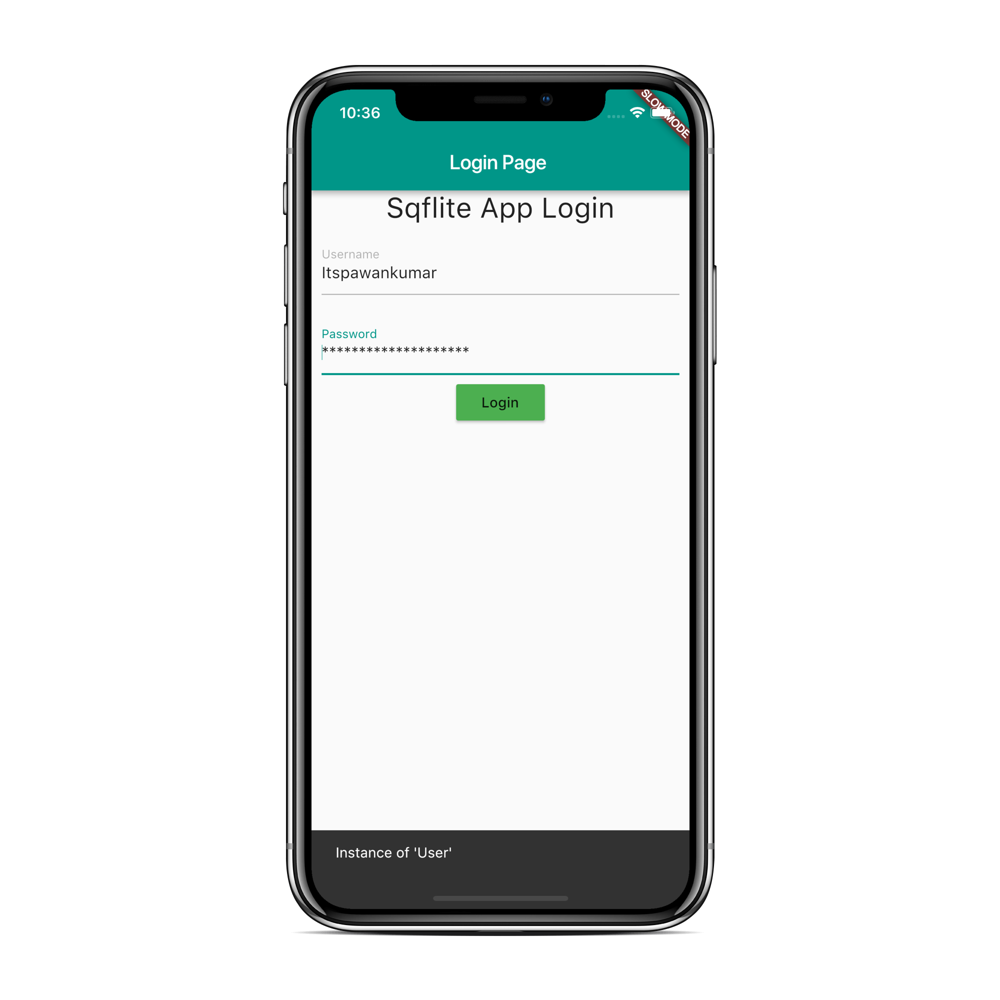

### Show some :heart: and star the repo to support the project

This repository containing links of all the example apps demonstrating features/functionality/integrations in [Flutter](https://flutter.io/) application development.

### Some Screenshots

   

## Example apps

1.  [Flutter WhatsApp Clone App](https://github.com/iampawan/FlutterWhatsAppClone)

1.  [Flutter Tic Tac Toe Game](https://github.com/iampawan/FlutterTicTacToe)

1.  [Flutter Music Player App](https://github.com/iampawan/Flutter-Music-Player)

1.  [Flute Music Plugin](https://github.com/iampawan/Flute-Music-Player)

1.  [Flutter With Firebase](https://github.com/iampawan/FlutterWithFirebase)

1.  [Flutter Bottom Sheet App](https://github.com/iampawan/FlutterBottomSheet)

1.  [Flutter WebSockets App](https://github.com/iampawan/flutter_websocket)

1.  [Flutter Sqflite MVP App](https://github.com/iampawan/Flutter-Sqflite-MVP)

1.  [Flutter Crypto App](https://github.com/iampawan/CryptoApp)

1.  [Flutter Redux App](https://github.com/iampawan/Redux-Tutorial-Flutter)

1.  [Flutter Frenzy Chat App](https://github.com/iampawan/frenzychatapp)

1.  [Flutter Calculator](https://github.com/iampawan/fluttercalculator)

1.  [Flutter Login Page App](https://github.com/iampawan/fluttercalculator)

1.  [Flutter Beautiful Material Navigation Drawer](https://www.youtube.com/watch?v=iYH2jzUM1Nc)

1.  [Flutter Material Design Widgets - | Tabs | BottomNavigationBar | Stepper | Snackbar etc App](https://www.youtube.com/watch?v=5_zQ6rjv00s)

1.  [Flutter Git Quick Start Guide](https://www.youtube.com/watch?v=kVow5q53WG8)

1.  [Flutter Local JSON App](https://www.youtube.com/watch?v=bTwTKwK3hGc)

1.  [Flutter Fetching App Using HTTP](https://www.youtube.com/watch?v=aIJU68Phi1w)

1.  [Flutter Swipe to delete ListView App](https://www.youtube.com/watch?v=AzOONgeCVKg)

1.  [Flutter Line Clipping App](https://www.youtube.com/watch?v=fqqY3NBVVHA)

1.  [Flutter Bezier Curve App](https://www.youtube.com/watch?v=LnUhNTUl3Mc)

# Pull Requests

I welcome and encourage all pull requests. It usually will take me within 24-48 hours to respond to any issue or request. Here are some basic rules to follow to ensure timely addition of your request:

1.  Match coding style (braces, spacing, etc.) This is best achieved using `Reformat Code` feature of Android Studio `CMD`+`Option`+`L` on Mac and `CTRL` + `ALT` + `L` on Linux + Windows .
2.  If its a feature, bugfix, or anything please only change code to what you specify.
3.  Please keep PR titles easy to read and descriptive of changes, this will make them easier to merge :)
4.  Pull requests _must_ be made against `develop` branch. Any other branch (unless specified by the maintainers) will get rejected.
5.  Check for existing [issues](https://github.com/iampawan/FlutterExampleApps) first, before filing an issue.
6.  Make sure you follow the set standard as all other projects in this repo do
7.  Have fun!

### Created & Maintained By

[Pawan Kumar](https://github.com/iampawan) ([@imthepk](https://www.twitter.com/imthepk)) ([Youtube](https://www.youtube.com/c/MTechViral))
([Insta](https://www.instagram.com/codepur_ka_superhero))

> If you found this project helpful or you learned something from the source code and want to thank me, consider buying me a cup of :coffee:
>
> * [PayPal](https://www.paypal.me/imthepk/)

# License

    Copyright 2018 Pawan Kumar

    Licensed under the Apache License, Version 2.0 (the "License");
    you may not use this file except in compliance with the License.
    You may obtain a copy of the License at

       http://www.apache.org/licenses/LICENSE-2.0

    Unless required by applicable law or agreed to in writing, software
    distributed under the License is distributed on an "AS IS" BASIS,
    WITHOUT WARRANTIES OR CONDITIONS OF ANY KIND, either express or implied.
    See the License for the specific language governing permissions and
    limitations under the License.

## Getting Started

For help getting started with Flutter, view our online
[documentation](http://flutter.io/).

For help on editing plugin code, view the [documentation](https://flutter.io/platform-plugins/#edit-code).
