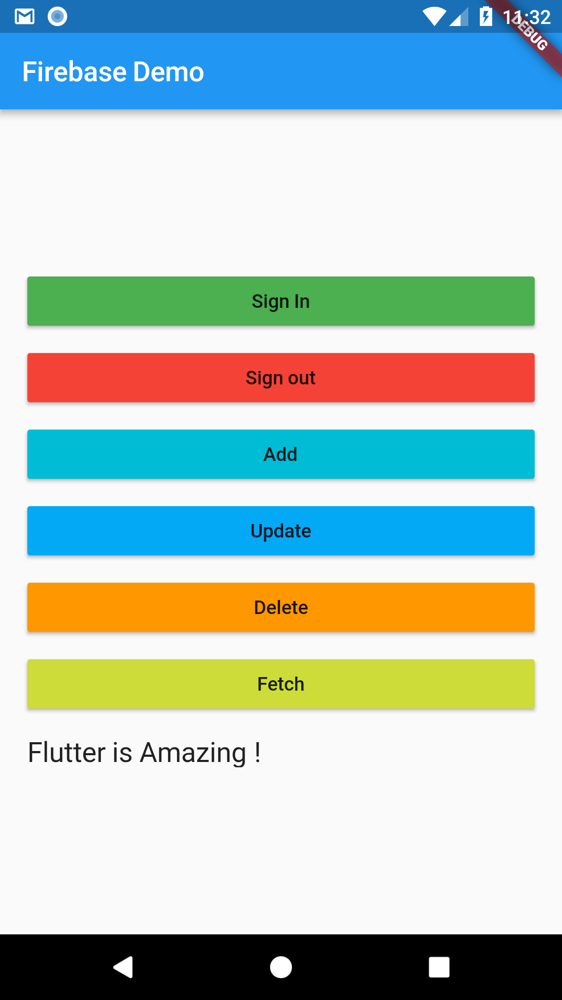
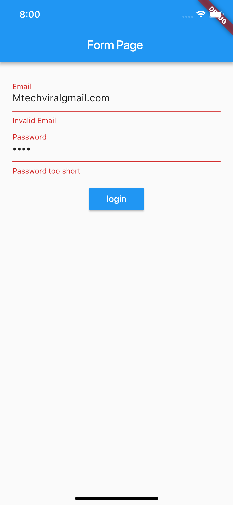
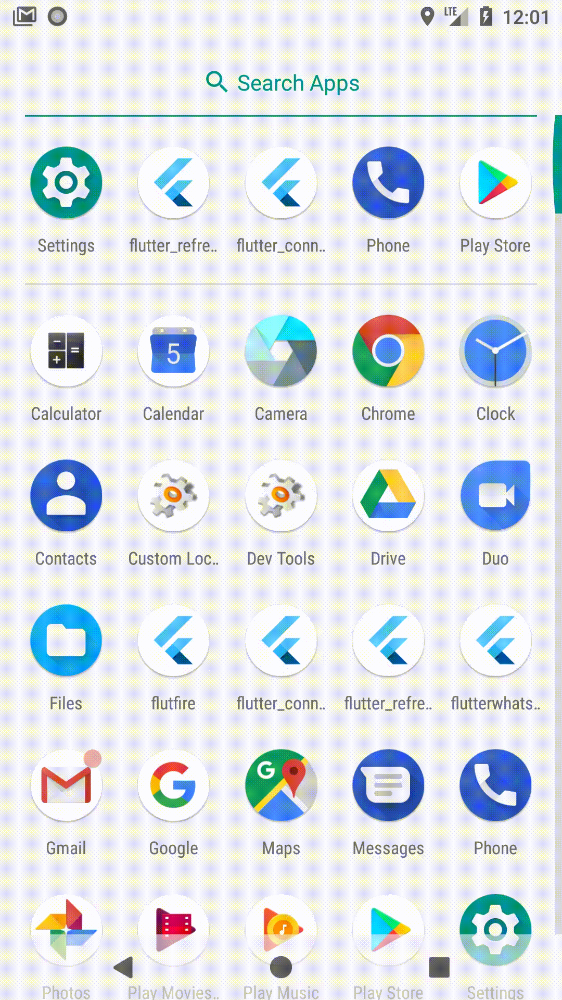

### Show some :heart: and star the repo to support the project

     

This repository containing links of all the example apps demonstrating features/functionality/integrations in [Flutter](https://flutter.io/) application development.

## YouTube Channel

[MTechViral](https://www.youtube.com/c/MTechViral)

## Facebook Group

[Let's Flutter](https://www.facebook.com/groups/425920117856409/)

### Some Screenshots

 

## Flutter Example Apps (Source Code + YouTube Link)

## Clones

1.  [Flutter WhatsApp Clone App](https://github.com/iampawan/FlutterWhatsAppClone)

1.  [Flutter Instagram Clone App](https://github.com/iampawan/Flutter-Instagram-UI-Clone)

## Beginners & Intermediate

1.  [Flutter Firebase MLKIT App](https://github.com/iampawan/FlutterWithFirebase/tree/mlkit)

1.  [Flutter Tic Tac Toe Game](https://github.com/iampawan/FlutterTicTacToe)

1.  [Flutter Music Player App](https://github.com/iampawan/Flutter-Music-Player)

1.  [Flute Music Plugin](https://github.com/iampawan/Flute-Music-Player)

1.  [Flutter Firebase Setup](https://github.com/iampawan/FlutterWithFirebase)

1.  [Flutter Firebase CRUD](https://github.com/iampawan/FlutterWithFirebase)

1.  [Flutter Bottom Sheet App](https://github.com/iampawan/FlutterBottomSheet)

1.  [Flutter WebSockets App](https://github.com/iampawan/flutter_websocket)

1.  [Flutter Sqflite MVP App](https://github.com/iampawan/Flutter-Sqflite-MVP)

1.  [Flutter Crypto App](https://github.com/iampawan/CryptoApp)

1.  [Flutter Redux App](https://github.com/iampawan/Redux-Tutorial-Flutter)

1.  [Flutter Frenzy Chat App](https://github.com/iampawan/frenzychatapp)

1.  [Flutter Calculator](https://github.com/iampawan/fluttercalculator)

1.  [Flutter Login Page App](https://github.com/iampawan/flutterlogin)

1.  [Flutter Beautiful Material Navigation Drawer](https://www.youtube.com/watch?v=iYH2jzUM1Nc)

1.  [Flutter Material Design Widgets - | Tabs | BottomNavigationBar | Stepper | Snackbar etc App](https://www.youtube.com/watch?v=5_zQ6rjv00s)

1.  [Flutter Git Quick Start Guide](https://www.youtube.com/watch?v=kVow5q53WG8)

1.  [Flutter Local JSON App](https://www.youtube.com/watch?v=bTwTKwK3hGc)

1.  [Flutter Fetching App Using HTTP](https://www.youtube.com/watch?v=aIJU68Phi1w)

1.  [Flutter Swipe to delete ListView App](https://www.youtube.com/watch?v=AzOONgeCVKg)

1.  [Flutter Line Clipping App](https://www.youtube.com/watch?v=fqqY3NBVVHA)

1.  [Flutter Bezier Curve App](https://www.youtube.com/watch?v=LnUhNTUl3Mc)

1.  [Flutter CryptoShadow](https://github.com/huextrat/CryptoShadow) [Hugo EXTRAT](https://github.com/huextrat/)

1.  [Flutter LifeCycle And Orientation](https://github.com/iampawan/FlutterLifeCycleAndOrientation)

1.  [Flutter Splash Screen - FlutKart](https://github.com/iampawan/FlutKart)

1.  [Flutter Walkthrough Package & App](https://github.com/iampawan/Flutter-Walkthrough)

1.  [Flutter Validating Form - Login Form](https://github.com/iampawan/FlutterForms)

1.  [Flutter Age Calculator App](https://github.com/iampawan/FlutterAnimatedAgeCalculatorApp)

1.  [Flutter Collapsing Toolbar Layout](https://github.com/iampawan/FlutterCollapsingToolbar)

1.  [Flutter PullToRefresh ListView](https://github.com/iampawan/flutter_pull_to_refresh)

1.  [Flutter Internet Connectivity](https://github.com/iampawan/flutter_connectivity)

1.  [Flutter Access Camera App](https://github.com/iampawan/FlutterWhatsAppClone)

1.  [Firebase Build Beautiful Wallpaper App P1](https://github.com/iampawan/FlutterWithFirebase)

1.  [Flutter: Integrate Ads | Create Admob Account P2](https://github.com/iampawan/FlutterWithFirebase)

1.  [Flutter: Integrate Analytics | Firebase Analytics | Handling Library Issues P3](https://github.com/iampawan/FlutterWithFirebase)

1.  [Flutter: Prepare App For Release | App Signing | Create JKS P4](https://github.com/iampawan/FlutterWithFirebase)

1.  [Flutter: Publish App to PlayStore | Fully Explained Demo P5](https://github.com/iampawan/FlutterWithFirebase)

1.  [Flutter: Expandable & Sticky Header List](https://github.com/iampawan/FlutterExpandableAndStickyHeaderList)

1.  [Flutter: Backdrop Widget Tutorial | Material Design 2.0](https://github.com/iampawan/FlutterBackdrop)

1.  [Flutter: QR Code Scanner App](https://github.com/iampawan/FlutterQRScanner-App)

1.  [Flutter: Integrate Google Maps Tutorial](https://github.com/iampawan/FlutterGoogleMaps)

1.  [VSCode Tips & Tricks | Flutter | 20 Useful Shortcuts](https://youtu.be/sCb44rmNMfM)

1.  [Flutter: Handle Back Button Pressed | WillPopScope Widget](https://youtu.be/fYBCzgBRkb4)

## Advanced

1.  [Flutter Advanced: Signature App (CustomPainter)](https://github.com/iampawan/fluttersignatureview)

1.  [Flutter Advanced: Dynamic Theming | Change Theme At Runtime](https://github.com/iampawan/Flutter-Dynamic-Theming)

1.  [Flutter Advanced: Inherited Widget & Scoped Model Explained | Part - 1](https://github.com/iampawan/StateExperiments)

1.  [Flutter Advanced: BloC Pattern Explained | Part - 2](https://github.com/iampawan/StateExperiments)

1.  [Flutter Advanced Redux: Shopping Cart App From Scratch | Redux Time Travel](https://github.com/iampawan/FlutterShoppingCart)

1.  [Flutter Advanced: Build Your First Plugin For Android & iOS | Flutter Toasts](https://github.com/iampawan/FlutterToastPlugin)

1.  [Flutter Advanced: Download Large Files (Pdf, Json, Image etc) With Progress %](https://github.com/iampawan/FlutterDownloadFilesWithProgress)

1.  [Flutter Advanced: Async Programming | Future | Async Await](https://youtu.be/JJ4MvlXooCU)

1.  [Flutter Advanced: Semantic Versioning](https://youtu.be/iua7TjbeRHA)

## Flutter Weekly Widgets Series

1.  [Flutter: SizedBox | Flutter Weekly Widgets | Ep 1 ](https://github.com/iampawan/FlutterWidgets)

1.  [Flutter: Animated Builder | Improve Performance | Ep 2 ](https://github.com/iampawan/FlutterWidgets)

1.  [Flutter: Draggable & Drag Target | Ep 3  ](https://github.com/iampawan/FlutterWidgets)

1.  [Flutter: World of Cupertino (iOS) | Ep 4 ](https://github.com/iampawan/FlutterWidgets)

1.  [Flutter: Data Table | Ep 5 | Flutter Weekly Widgets ](https://github.com/iampawan/FlutterWidgets)

1.  [Flutter: WebView | Browser App | Ep 6 | Website to App](https://github.com/iampawan/FlutterWidgets)

1.  [Flutter Advanced: Overlay Widget | Ep 7 | Flutter Weekly Widgets ](https://github.com/iampawan/FlutterWidgets)

## Plugins on pub.dartlang.org

1.  [Flutter Flute Music Plugin - First Open Source Flutter based material design music player with audio plugin to play local music files.(Online Radio will be added soon).](https://pub.dartlang.org/packages/flute_music_player)

1.  [Flutter Walkthrough - A new Flutter package for both android and iOS which helps developers in creating animated walkthrough of their app.](https://pub.dartlang.org/packages/flutter_walkthrough)

1.  [Flutter Toast PK - A new Flutter plugin for showing toast in android and ios.](https://pub.dartlang.org/packages/flutter_toast_pk)

1.  [Random PK - A new Flutter package that gives a container with random color.](https://pub.dartlang.org/packages/random_pk)

## Dart Aqueduct Backend Course (Source Code + YouTube Link)

1.  [Dart: How to Setup Aqueduct | Intro | Aqueduct](https://github.com/iampawan/DartFirstApi)
1.  [Dart: How to write your first REST API | Intro & 1/7 | Aqueduct](https://github.com/iampawan/DartQuizApi)
1.  [Dart: How to make controllers ? | 1/7 | Aqueduct](https://github.com/iampawan/DartQuizApi)
1.  [Dart: Indexing And Routing ? | 2/7 | Aqueduct](https://github.com/iampawan/DartQuizApi)
1.  [Dart: How to write tests ? | 3/7 | Aqueduct](https://github.com/iampawan/DartQuizApi)
1.  [Dart: How to setup PostgreSQL ? | 4/7 | Aqueduct](https://github.com/iampawan/DartQuizApi)
1.  [Dart: How to write tests with test db ? | 5/7 | Aqueduct](https://github.com/iampawan/DartQuizApi)
1.  [Dart: What is ORM ? | 5/7 | Aqueduct](https://github.com/iampawan/DartQuizApi)
1.  [Dart: How to make DataModels ? | 5/7 | Aqueduct](https://github.com/iampawan/DartQuizApi)
1.  [Dart: What are Relationships and Joins | 6/7 | Aqueduct](https://github.com/iampawan/DartQuizApi)
1.  [Dart: How to deploy to real database ? | 7/7 | Aqueduct](https://github.com/iampawan/DartQuizApi)

# Pull Requests

I welcome and encourage all pull requests. It usually will take me within 24-48 hours to respond to any issue or request. Here are some basic rules to follow to ensure timely addition of your request:

1.  Match coding style (braces, spacing, etc.) This is best achieved using `Reformat Code` feature of Android Studio `CMD`+`Option`+`L` on Mac and `CTRL` + `ALT` + `L` on Linux + Windows .
2.  If its a feature, bugfix, or anything please only change code to what you specify.
3.  Please keep PR titles easy to read and descriptive of changes, this will make them easier to merge :)
4.  Pull requests _must_ be made against `develop` branch. Any other branch (unless specified by the maintainers) will get rejected.
5.  Check for existing [issues](https://github.com/iampawan/FlutterExampleApps/issues) first, before filing an issue.
6.  Make sure you follow the set standard as all other projects in this repo do
7.  Have fun!

### Created & Maintained By

[Pawan Kumar](https://github.com/iampawan) ([@imthepk](https://www.twitter.com/imthepk)) ([YouTube](https://www.youtube.com/c/MTechViral))
([Instagram](https://www.instagram.com/codepur_ka_superhero))

> If you found this project helpful or you learned something from the source code and want to thank me, consider buying me a cup of :coffee:
>
> - [PayPal](https://www.paypal.me/imthepk/)

# License

    Copyright 2018 Pawan Kumar

    Licensed under the Apache License, Version 2.0 (the "License");
    you may not use this file except in compliance with the License.
    You may obtain a copy of the License at

       http://www.apache.org/licenses/LICENSE-2.0

    Unless required by applicable law or agreed to in writing, software
    distributed under the License is distributed on an "AS IS" BASIS,
    WITHOUT WARRANTIES OR CONDITIONS OF ANY KIND, either express or implied.
    See the License for the specific language governing permissions and
    limitations under the License.

## Getting Started

For help getting started with Flutter, view our online
[documentation](http://flutter.io/).

For help on editing plugin code, view the [documentation](https://flutter.io/platform-plugins/#edit-code).
